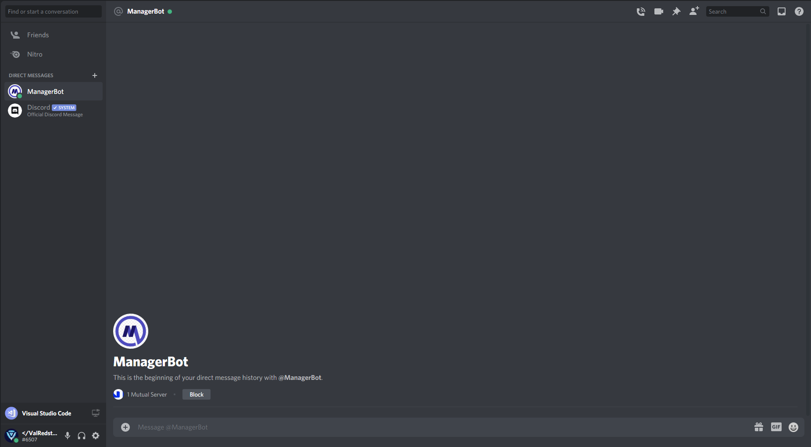
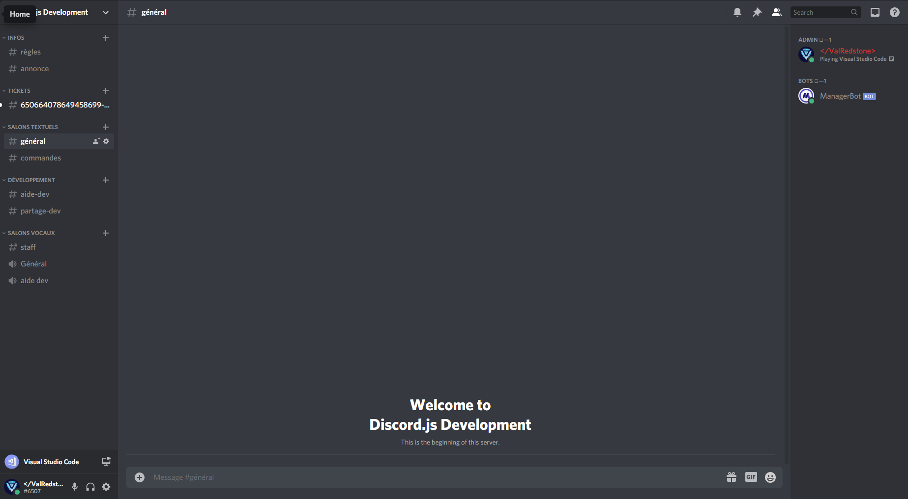
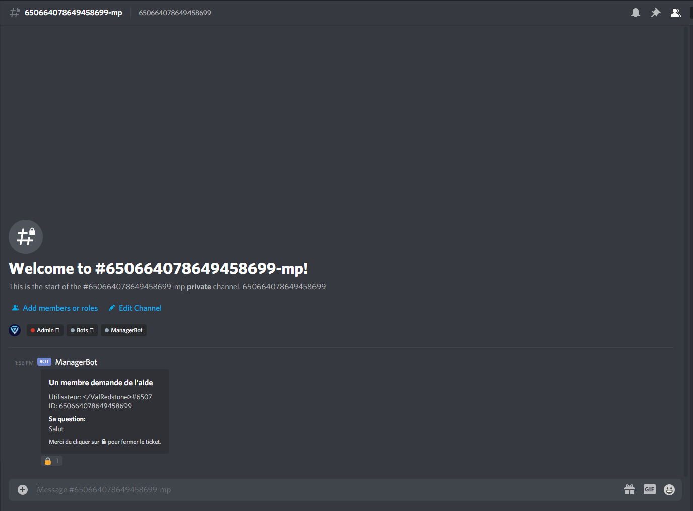
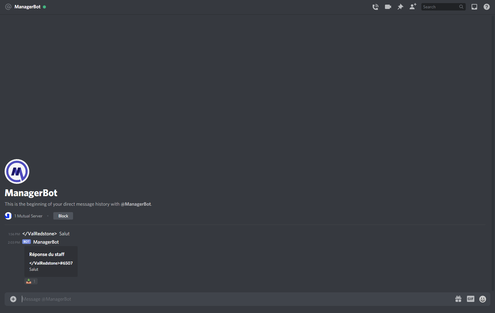
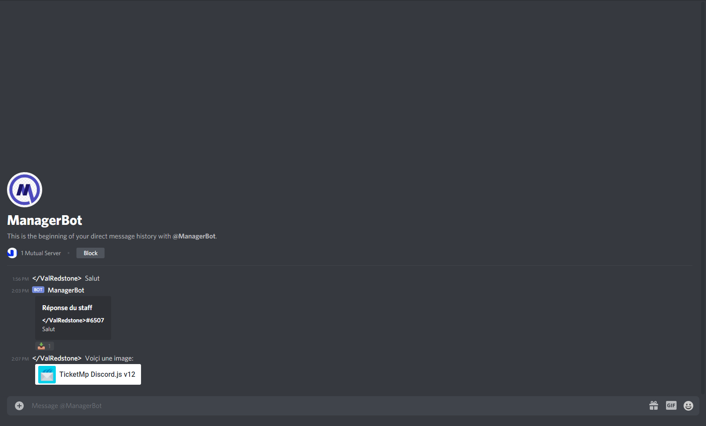
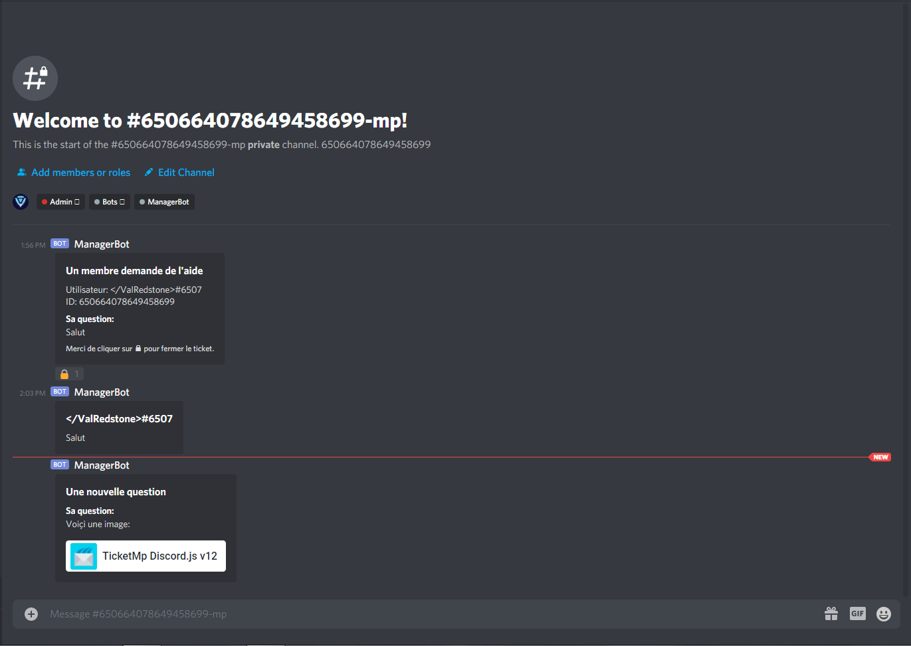

# Démonstration

Pour commencer, rendez vous dans les messages privés de votre bot.

Envoyez lui un message et allez dans le serveur où vous avez récupéré l'ID.

Une nouvelle catégorie et un nouveau channel ont été créé.  
La catégorie sert à ranger tout les tickets dedans, et le channel sert à communiquer via les MP \(messages privés\) du bot à l'utilisateur des messages.  
  
Rendez vous dans le nouveau ticket \(channel\).  
Vous aurez un message sous cette forme.

Dans l'embed il y aura:  
- le pseudo + tag de la personne  
- l'ID de la personne  
- son message/question  
- la réaction qui permet de fermer le ticket

Pour commencer, envoyer un message via le channel puis regardez vos MP.

Maintenant, envoyez une image \(avec du texte sinon ça ne marchera pas\).

Une fois cela fait allez dans le channel créé précédemment par le bot.

Le système avec l'image fonctionne dans les deux sens \(`user => server` et `server => user` \) comme pour le système de messages.

