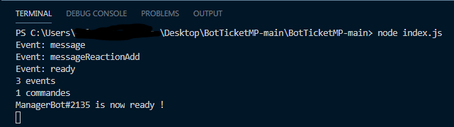

# Allumer le bot

Pour allumer le bot, commencez par aller dans le terminal \(vu sur cette [page](https://valredstone.gitbook.io/ticketmp-discord-js-v12/parametrage-du-bot/exportation-et-mis-en-place-du-code)\),  
et tapez la commande `node index.js` le bot va se lancer \(ça va vous faire ceci\).

Cette page aura été très courte mais autant donner des explications sur comment l'allumer.

Passez à la page suivante pour savoir comment fonctionne le système.

