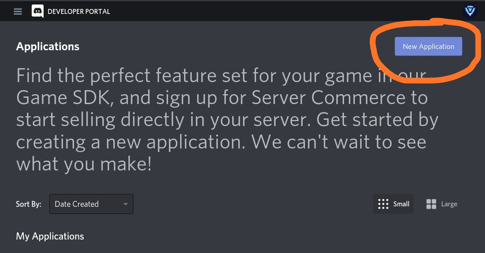
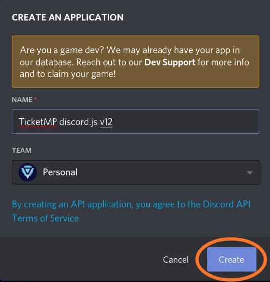
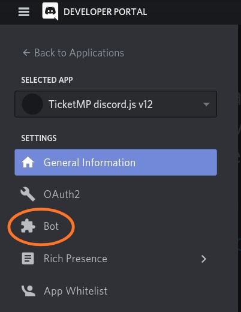
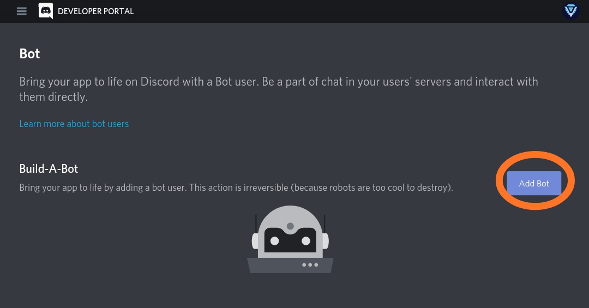
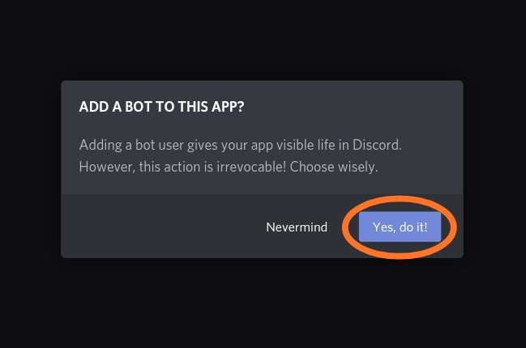
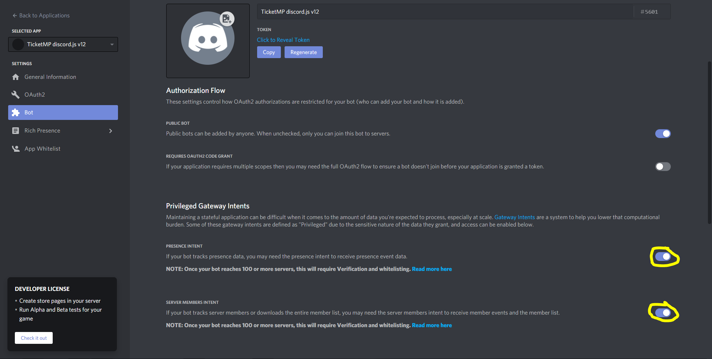

# Création du bot

Pour créer une application \(bot discord\) vous pouvez cliquer sur ce [lien](https://discord.com/developers/applications/).

Une fois sur cette page vous pouvez appuyer sur New Application.

Une fois cela fait, vous pouvez donner un nom à votre application et appuyer sur le bouton create.

Une fois l'application créée vous devez aller dans l'onglet Bot se trouvant içi.

Une fois dedans cliquez sur Add Bot puis Yes Do It.

Maintenant vous devez activer les intents de l'application \(cela va servir pour le code\).

Votre application est maintenant finie.  
  
Passez à la page suivante pour l'exportation et la mis-en-place du code.

