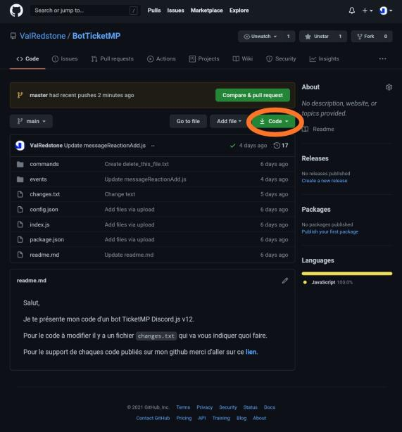
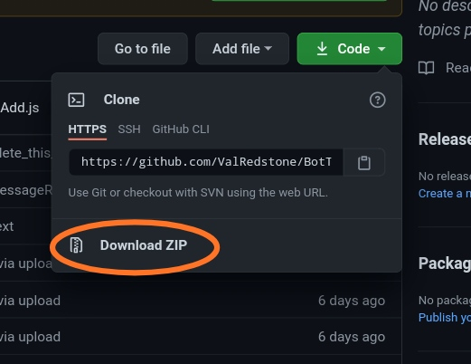
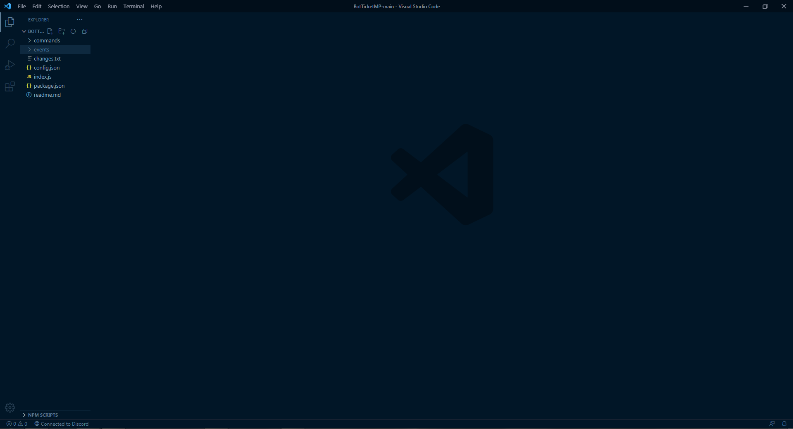

# Exportation et mis-en-place du code

Pour commencer rendez vous sur le [github du système](https://github.com/ValRedstone/BotTicketMP/tree/main).  
  
Une fois dessus vous allez devoir cliquer sur ceci.

Une fois que vous aurez cliquer dessus il y aura un fenêtre qui s'ouvrira, dans laquelle vous devrez cliquer sur Download Zip

Une fois le fichier Zip téléchargé vous allez devoir l'extraire et ouvrir le fichier qui vient de se faire extraire du fichier Zip dans votre éditeur de texte \(pour moi: Visual Studio Code\).

Une fois que le code est ouvert vous pouvez ouvrir le terminal \(En haut : Terminal &gt; New Terminal\)

